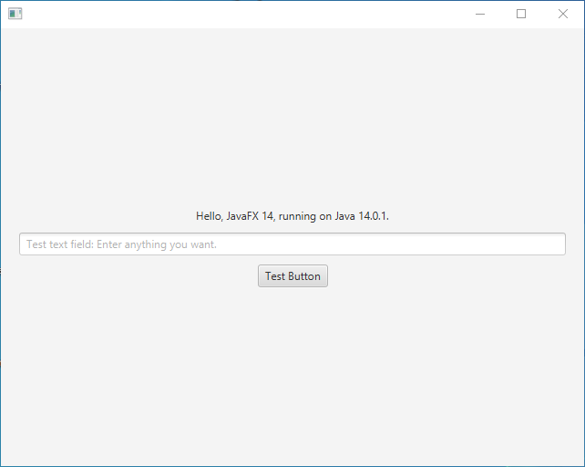

javafx-helloworld
=================

This project is a small [JavaFX](https://openjfx.io/) app for testing purposes.
It provides for each main OS (x64/x86 arch) a simple window application to see, if the JavaFX framework is functional under the operating system.
The app is distributed with its own JVM and executable, thus no preinstalled JDK is required.

Screenshot how it should look like (Windows):

